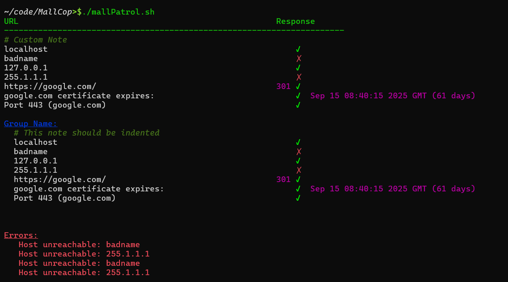

# Mall Cop
## Monitoring and Alerting for Loading from a List - Central Observation Process

This script reads a list of servers from a file (default is `urls.list`) and performs several common querys to  make sure the server is responding as expected.



## Usage

To use MallCop, download the latest version of `MallPatrol.sh` from this repo.
Create a `urls.list` file in the same folder as the script and add entries of servers to monitor using the [Available Options](#available-options) listed below.
Each entry should be on a separate line.
Also, be sure the file ends with one or more empty lines (or the last line will not be properly parsed).

Successful test will be marked with a `✓` mark.

If any errors were detected, the corresponding line will be marked with an `✗`.
The details of the error will also be provided in a summary at the end of the tests in an `Errors:` section.


## Available options: 

The following is a list of prefixes and options that are available for use in the list file provided to MallPatrol.


## ping (Default)

If a line only contains an IP address or a hostname (FQDN), then the provided value will be pinged for a response.
A response of less than 1 seconds is considered an error.

Example

```
192.168.51.49
dev01.domain.net
```


## [Group]

To group entries under a heading for easier consuption, groups may be defined using this option.
To create a group, surround the group name with square brackets.
Items within a group will be indented in the output

To end a group, use an empty line.

Example:

```
[Dev]
dev01.domain.net
http://localhost:8002


[Stage]
server2.domain.net
cert server2.domain.net
https://server2.domain.net


[Production]
server1.domain.net
cert server1.domain.net
https://server1.domain.net
```


### http | https

Lines starting with 'http(s)' will use curl for the check.
If a status code other than 200 is expected, add it as the second word on the line.
**NOTE**: Spaces in URLs must be html encoded

Examples: 

```
https://host.domain.net

# If a 202 Status response is expected
https://host.domain.net 202
```


### cert

Lines starting with 'cert' followed by a hostname will retrieve the certificate expiration date for the given Server.
A warning will be raise if the age less than 30 days.
To change this default warning age, a second argument can be provided.

Example:

```
cert host.domain.net

# To warn when certificate expires in 90 days or less
cert host.domain.net 90
```


### port

Lines starting with 'port' will check if the specified port for the given Server is open
 
Example:

```
port host.domain.net 27017
```


### note

Lines starting with `note` will be echo'ed to the output during execution

Example:

```
note My custom message to show in output
```


### # (comment)

Lines starting with `#` are considered comments and will be skipped.

Exmaple:

```
# This line will NOT be printed to the output
note This line will appear in the output
```

## Example Input List File

```txt
# Internal Comment
note Custom note to print during execution
localhost
badname
127.0.0.1
255.1.1.1
https://google.com/ 301
cert google.com 60
port google.com 443

[Group Name]
note This note should be indented with the group
localhost
badname
127.0.0.1
255.1.1.1
https://google.com/ 301
cert google.com 60
port google.com 443


# Be sure to end with an empty line

```